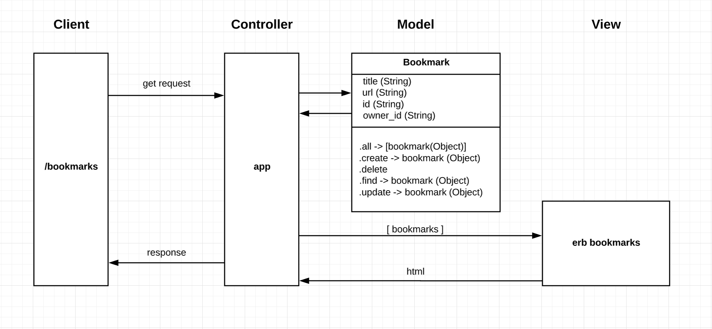
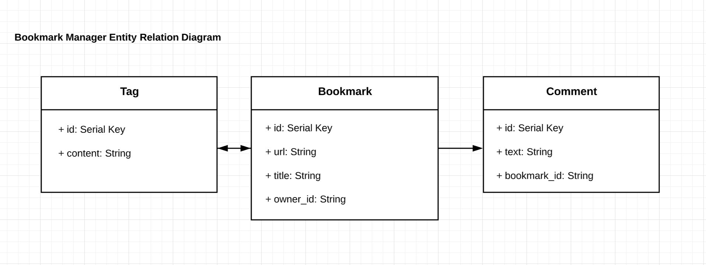

# Bookmark Manager

## User Stories

```
As a time-pressed user
So that I can quickly go to web sites I regularly visit
I would like to see a list of bookmarks
```

```
As a user
So I can store bookmark data for later retrieval
I want to add a bookmark to Bookmark Manager
```

```
As a user
So that I can keep my bookmarks relevant
I want to delete a bookmark
```

```
As a user
So that I can keep my bookmarks up to date
I want to edit a bookmark
```

```
As a user
So that the bookmarks I save are useful
I want to only save a valid URL
```

```
As a user
So that I can make interesting notes
I want to add a Comment to a Bookmark
```

```
As a user
So that I can categorize my bookmarks
I want to add a Tag to a Bookmark
```

```
As a user
So that I can find relevant bookmarks
I want to filter Bookmarks by a Tag
```

```
As a user
So that I can have a personalised bookmark list
I want to sign up with my email address
```

```
As a user
So that I can keep my account secure
I want to sign in with my email and password
```

```
As a user
So that I can keep my account secure
I want to sign out
```

## Domain Model

Below is a domain model for the bookmarks model.




## Entity Relationship Diagram

The below diagram indicates that:
- A Bookmark *has many* Comments
- A Comment *belongs to* a Bookmark



## How to use

### Prerequisites

- The PostgreSQL database management system must be installed on your system.

### To set up the project

Clone this repository and then run:

```
bundle
```

## Getting Started

> If you clone this app, you will have a ready-to-go application with RSpec, Sinatra, and Capybara installed.

To get started with Bookmark Manager:

```
cd bookmark_manager_challenge
bundle install
rake setup
rspec
```

This will give you the application, and set up two databases: `bookmark_manager` for the development environment, and `bookmark_manager_test` for the test environment.